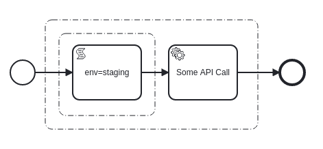
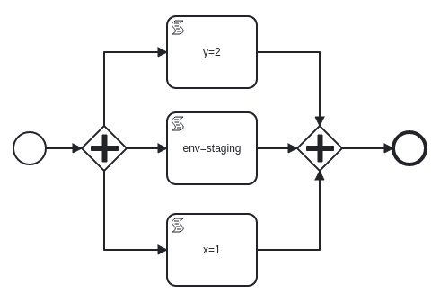

# On the Execution and Decomposition of BPMN Diagrams via Element Units

_TODO: this started off all about execution but I think its really going to be about decomposition with a true parallel gateway and maybe some other handling. If so maybe this is just a summary of why we can decompose to gain implicit parallel execution via task units?_

This document outlines a set of progressive enhancements to the current strategy for the execution of BPMN diagrams within [SpiffArena](https://github.com/sartography/spiff-arena) which leverages [SpiffWorkflow](https://github.com/sartography/SpiffWorkflow). The end goal is a more stable and performant system that is able to simultaneously execute multiple process instances ranging from small and simple to large and complex (such as MVP/PP1).

## Current State of BPMN Execution in SpiffArena

Currently SpiffArena is a sound execution environment for BPMN diagrams. For simpler diagrams element execution is very fast - often measured in milliseconds. Diagrams are primarily executed within a Flask request but can be handled by the background processor. Historically the background processor was used to handle events such as timers, but it can run any non-human task. 

Since SpiffArena executes diagrams within Flask requests and from the background processor, parallel execution of individual process instances is provided. There is no support for parallel execution of tasks within a single process instance however (true even when Parallel Gateways are used).

The Flask app and the background processor can be configured to use different strategies when executing diagrams. Currently the "greedy" strategy is used which simply runs all non-human tasks until either the workflow completes or a human task is encountered. When executing this way the entire workflow is loaded and the available steps are executed. The advantage to this is simplicity, the downside is a long running process will block the request until it completes. This is perceived as slowness by the user while they are waiting on information after they press the "Go" or "Submit" button. If the background processor encounters a long running process it will block the thread until completion which often means other jobs are not run in a timely fashion.

## Enter the Interstitial Page

With the concept of the "interstitial page" and the different execution strategies for the Flask requests and background processor, we can configure Flask requests to "run until a Service Task" and have the background processor be "greedy". This is a step closer to the end goal, but:

1. What if a diagram is started that runs for an extended period of time before a Service Task?
1. What if a diagram with a large number of alternating User Tasks and Service Tasks was started?
1. What if a large number of processes are started and shift all long running work to a finite number of "greedy" background processors?

With some progressive enhancements to the current execution model we can start to take steps to alleviate these issues.

## A Quick Introduction to Element Units

Core to the progressive enhancements in this document are the concept of "element units". An element unit is defined as either a) an entire process or b) a defined subset of BPMN elements which can be executed in isolation. For the sake of this introduction "executed in isolation" means placing the element unit in an empty process between a start and end event, then running that process. As the ability to extract element units from other element units increases, so does the ability to execute large and complex workflows as if they were many small, simple diagrams.

How element units are formed from decomposing diagrams and how this promotes efficient parallel execution will be described in more detail below.

## Progressive Enhancements

The progressive enhancements below are designed to work on element units - which means they can begin to work with the execution of an entire process as is done today. As task units become more granular the effects of these enhancements multiply.

### Recognize and Execute Element Units

When the ProcessInstanceProcessor is constructed, the entire workflow is loaded. If we inject the concept of element units into `__get_bpmn_process_instance` (i think?) then once element units become more granular we won't need to load an entire process to execute a subset of its elements. There may very well be some work required to map logs/steps back to the correct element records, but once done that should continue to work as element units are refined.

### Continue to Refine Element Units

As mentioned above, honing the ability to extract element units from other element units will move Spiff in the direction of always executing small, manageable processes. 

Since an entire process is a valid element unit, if we encounter a process model that we do not yet know how to identify more granular element units for, we fall back to executing the entire process as we do today.

### Element Unit Based Execution Strategies

Currently the Flask app and background processor each have their own environment variable to set their execution strategy. The current options are "greedy" or "run_until_service_task". These environment variables are defaults, but nothing ever overrides them. It would be preferable to have the ability to detect the appropriate execution strategy for any given element unit instead of simply assuming the strategy based on the host application. This could be done by inspecting the task tree of a given element unit. As element units become more granular this would allow for more specialized step execution for portions of a process. Some form of "cost" for a given element unit could also be considered when determining the execution strategy.

It should be noted that for some element units, execution in the Flask request will be the fastest option.

### Add Truly Parallel Gateway(s)

The existing Parallel Gateway implementation does not actually result in parallel execution. Since each branch of a Parallel Gateway is an element unit and element units by definition can run in isolation we should be able to achieve parallel execution just as we do for separate workflows. Specialized Parallel Gateway implementations could be defined for specific scenarios. For instance if the Parallel Gateway consisted of only Service Tasks it could be executed differently than one that contained human tasks.

### Add More Specialized Background Processing Jobs

Today the background processor has two specialized jobs - one for "waiting" instances and one for "user_input_required" instances which checks for an associated timer event. For the "waiting" process instances we don't really know anything about what it is waiting on, so the whole process instance is loaded and engine steps are done. If the background processor were able to know more about the waiting task unit for process instances, we could have specialized background jobs for certain scenarios. For instance, one background job could "run_until_service_task" and take care of lots of cheap tasks across many process instances. Then another background job could scan for all the "waiting on a service task to be run" processes. These requests could then be made asynchronously while the first background job has gone back to churn on the next batch of "quick" tasks.

### More Strategic Scheduling of Background Processing Jobs

If a process is waiting on a timer to fire, it will be checked every 10 (or 120) seconds to see if that timer has elapsed. If a large number of these processes are started they will bog down the background processor. As we add more background processing jobs and decrease the interval between runs these processes will pose more of an issue. We currently have a "run_at" column but it is not used. However this ends up being addressed, these records should not be picked up until the timer would logically fire.

### Cooperatively Execute Process Instances in the Background

The background processor attempts to execute any waiting process instance to completion. To elaborate on the "what if" scenario from above - imagine a case where a large number of PP1 instances have been started and are "waiting" in the background. If each instance takes tens of seconds or minutes to complete the background processor will quickly become overwhelmed. Running more jobs will help some but in practice will only allow a few more instances to complete at any given time. Since the entire workflow is required to complete an engine step, it is prohibitively expensive to perform a single step. Once element units become more granular and are the target of execution it will be cheaper to execute a small amount of steps at a time. When this can be realized then all workflows can be cooperatively executed. Element unit boundaries will serve as a yield point in the larger process execution.

### Begin Marking Element Units as Pure/Const

Knowing which element units only operate on the data passed to them and have no side effects will allow for smarter decisions to be made as to the dependencies between element units and which element units can be run in parallel.

These element units will also have an interesting property in that they can safely be executed multiple times. For example, they could safely be sent to multiple nodes for execution where the first response wins and the subsequent responses are used to validate/reach a consensus. Non-pure element units would in turn act as a barrier requiring that they are executed by a single node to manage the side effects.

### Operate With Subsets/Deltas of the Environment

Currently the entire task data/Python environment is loaded and provided to each task for execution. As smaller element units are identified we will have more information about what each element unit needs from the environment. A similar issue exists when submitting User Task forms. Providing a smaller environment will be another step towards loading fewer things into memory to execute a step. Similarly, the result of executing a element unit can be tracked as a delta instead of a new copy of the environment.

### Apply Known Optimizations to Element Units

When element units are small in scope it would be much easier to apply known and safe optimizations to further improve runtime performance. It is feasible that performing some basic optimizations such as constant propagation/folding would result in "unused variables". Once those are removed then dependencies between element units could be severed. Once two previously dependent element units are separated they can both be run in parallel.

When doing this the issue will arise of how to map the optimized element units back to their original tasks. This can be handled by tracking "source locations" much like compilers do today.

[Some Examples](https://github.com/jbirddog/mamba)

## Forming Task Units by Decomposing BPMN Diagrams

To reiterate, an entire process as we think of it today is itself an element unit. The progressive enhancements described above become more impactful as the element units become more granular. The question then becomes - how can we extract element units from any BPMN diagram? The answer is very carefully. The process will begin slowly and once proved more complex extractions can be performed. As previously mentioned, the fallback is always to execute the entire process task unit as we do today. With that in mind:

**To begin consider the empty process:**


This process can be renamed or run any number of times and produce the same `{}` end result. It has only one element unit, which is the entire process. There is no proper subset of tasks that can be run in isolation - running just a start or an end event doesn't make sense.

**For a process with a single task:**


Like the empty process this process can be renamed or run any number of times and produce the same `{"x": 1}` result. It has one element unit in addition to the entire process which is, for illustration, within the dotted line group. If this element unit is extracted and placed in the empty workflow from above and executed, it will produce the expected result of `{"x": 1}`. If this result is placed back in the original workflow and the task unit "completed", the original workflow would also have the result of `{"x": 1}`.

While over simplified, this example forms the basis for how element units can be formed by decomposing BPMN diagrams.

**An example showing multiple element units with dependencies:**


In this example process there are three script tasks which when run will produce the result `{"x": 1, "y": 2, "z": 3}`. The first of four non-process element units is shown in the group above. Inside this element unit there is another for the first two script tasks since they could be run in isolation:


There are also two more element units inside:


The detection of these elment units tell us that we can execute the first task and the second task in isolation, but before the third task can be executed the results of the first two must be placed back in the workflow. Once this happens and the third task completes, the workflow will have the expected results of `{"x": 1 , "y": 2, "z": 3}`.

## How Element Units Promote Parallel Execution of BPMN Diagrams

In the last example from above, it was determined that the first two tasks can run in isolation. This means they could be placed in an empty process between a start and end event. When that process is executed the result of the task will be available and can be returned to the original process. If these two tasks were put in two separate empty process, they could be executed by two different background jobs in parallel. These two workflows would be very small and execute very quickly. A single background job could execute dozens of processes like this (which could potentially span multiple process instances) per run.

Granted in this over simplified example it would be faster to just run all three script tasks. The point of this illustration however is to show what could happen if element units were identified. Imagine instead of a simple workflow with three script tasks this was a very large process like PP1, and instead of loading 1000s of tasks into memory to execute a script task, just a element unit of three script tasks needed to be loaded to make progress. Now imagine this is happening across many instances of PP1.

## Forming BPMN Diagrams From Decomposed Element Units

Once element units can be executed in empty processes, the next logical step is forming more complex BPMN Diagrams from element units that may or may not originate from completely separate diagrams - for the sake of efficient execution. For example, consider that the two element units from the example above have been scheduled for parallel processing by a background job:


as has the most inner element unit in the below diagram:



Hypothetically, these could be "sqaushed" into a single diagram:



When executed this single diagram would contain the results of all three tasks, which can then be returned to their respective workflows. Assuming a truly Parallel Gateway this would achieve the same results as running the element units of two separate processes in their own empty process.

Exactly how errors are handled/propagated, environments blended and how results are fed back to the original workflow will need to be defined in more detail.

# old stuff to maybe mention in the parallel execution part (editing stopped here)

~~~~~~~~~~~~~~~~~~~~~~~~~~~~~~~~~~~~~~~~~~~~~~~~~~~~~~~~~~~~~~~~~~~~~~~~~~~~


It is believed that everything is as valid as it is today with regards to [the spec](https://www.omg.org/spec/BPMN/2.0/PDF) (namely chapter 13). If any caveats exist we assume that the absense of the `isImmediate` attribute on `Sequence Flows` means _false_. Further we also assume this is always absent (as it is today). With that we quote:

```
Token movement across a Sequence Flow does not have any timing constraints. A token might take a long or short time
to move across the Sequence Flow. If the isImmediate attribute of a Sequence Flow has a value of false, or has
no value and is taken to mean false, then Activities not in the model MAY be executed while the token is moving along
the Sequence Flow. If the isImmediate attribute of a Sequence Flow has a value of true, or has no value and is
taken to mean true, then Activities not in the model MAY NOT be executed while the token is moving along the
Sequence Flow.
```

For the sake of this document the above passage distills to the following quoted points:

1. Token movement across a Sequence Flow does not have any timing constraints.
2. If the isImmediate attribute of a Sequence Flow has a value of false, or has no value and is taken to mean false, then Activities not in the model MAY be executed while the token is moving along the Sequence Flow.

With the above assumption that the absense of the `isImmediate` attribute on `Sequence Flows` means _false_ we can further distill to our version:

1. Token movement across a Sequence Flow does not have any timing constraints.
2. Activities not in the model MAY be executed while the token is moving along the Sequence Flow.


