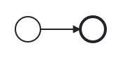
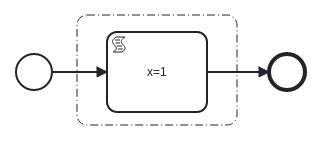
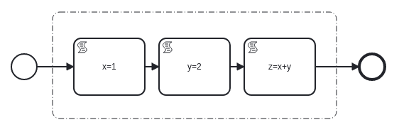
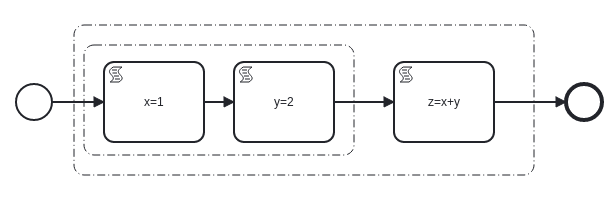
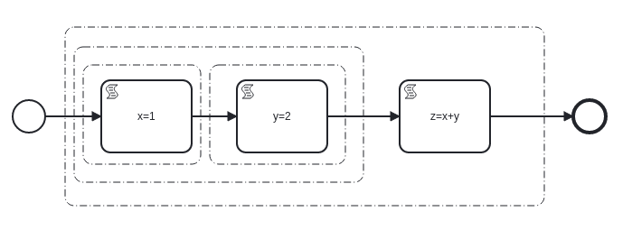

# On the Execution and Decomposition of BPMN Diagrams via Task Units

_TODO: this started off all about execution but I think its really going to be about decomposition with a true parallel gateway and maybe some other handling. If so maybe this is just a summary of why we can decompose to gain implicit parallel execution via task units?_

This document outlines a set of progressive enhancements to the current strategy for the execution of BPMN diagrams within [SpiffArena](https://github.com/sartography/spiff-arena) which leverages [SpiffWorkflow](https://github.com/sartography/SpiffWorkflow). The end goal is a more stable and performant system that is able to simulatenously execute multiple process instances ranging from small and simple to large and complex (such as MVP/PP1).

## Current State of BPMN Execution in SpiffArena

Today SpiffArena has a sound execution environment for BPMN diagrams. For diagrams on the simpler side execution is very fast - often measured in milliseconds. Diagrams are primarily executed within a Flask request but can be handled by the background processor. Historically the background processor was used to handle events such as timers but it can run any non human task. 

Since SpiffArena executes diagrams within Flask requests and from the background processor, parallel execution of individual process instances is provided. There is no support for parallel execution of tasks within a single process instance however (true even when Parallel Gateways are used).

The Flask app and the background processor can be configured to use different strategies when executing diagrams. Currently the "greedy" strategy is used which simply runs all non human tasks until either the workflow completes or a human task is encountered. When executing this way the entire workflow is loaded and the available steps are executed. The advantage to this is simplicity, the downside is a long running process will block the request until it completes. This is perceived as slowness by the user while they are waiting on information after they press the "Run" or "Submit" button. If the background processor encounters a long running process it will block the thread until completion which often means other jobs are not run in a timely fashion.

## Enter the Interstitial Page

With the concept of the "interstitial page" and the different execution straties for the Flask requests and background processor, we can configure Flask requests to "run until a Service Task" and have the background processor be "greedy". This is a step closer to the end goal, but:

1. What if a diagram is started that runs for an extended period of time before a Service Task?
1. What if a diagram with thousands of alternating User Tasks and Service Tasks was started?
1. What if a large number of processes are started and shift all long running work to a finite number of "greedy" background processors?

With some progressive enhancements to the current execution model we can start to take steps to allevate these issues.

## A Quick Introduction to Task Units

Core to the progressive enhancements in this document are the concept of "Task Units". A task unit is defined as either a) an entire workflow or b) a proper subset of another task unit that can be executed in isolation. For the sake of this introduction "executed in isolation" means placing the task unit in an empty worklow between a start and end event, then running that workflow. As the ability to extract task units from other task units increases, so does the ability to execute large and complex workflows as if they were many small, simple diagrams.

How task units are formed from decomposing diagrams and how this promotes efficient parallel execution will be described in more detail below.

## Progressive Enhancements

The progressive enchancements below are designed to work on task units - which means they can begin to work with the execution of an entire workflow as is done today. As task units become more granular the effects of these enhancements mulitply.

### Recognize and Execute Task Units

When the ProcessInstanceProcessor is constructed, the entire workflow is loaded. If we inject the concept of task units into `__get_bpmn_process_instance` (i think?) then once task units become more granular we won't need to load an entire workflow to execute a subset of its tasks. There very well may be some work required to map logs/steps back to the correct task records but once done that should continue to work as task units are refined.

### Continue to Refine Task Units

As mentioned above, honing the ability to extract task units from other task units will move us in the direction of always executing small, managable workflows. 

Since an entire workflow is a valid task unit, if we encounter a process model that we do not yet know how to identifiy more granular task units for, we fall back to executing the entire workflow as we do today.

### Task Unit Based Execution Strategies

Currently the Flask app and background processor each have their own environment variable to set their execution strategy. The current options are "greedy" or "run_until_service_task". These environment variables are defaults but nothing ever overrides them. It would be nice to have the ability to detect the appropriate execution strategy for any given task unit instead of simply assuming the strategy based on the host application. This could be done by inspecting the task tree of a given task unit. As task units become more granular this would allow for more specialized step execution for portions of a workflow. Some form of "cost" for a given task unit could also be considered when determining the execution strategy.

It should be noted that for some task units, being executed in the Flask request will be the fastest option.

### Add Truly Parallel Gateway(s)

The existing Parallel Gateway implementation does not actually result in parallel execution. Since each branch of a Parallel Gateway is a task unit and task units by definition can run in isolation we should be able to achieve parallel execution just as we do for separate workflows. Specialized Parallel Gateway implementations could be defined for specific scenarios. For instance if the Parallel Gateway was comprised of only Service Tasks it could be executed differently than one that contained human tasks.

### Add More Specialized Background Processing Jobs

Today the background processor has two specialized jobs - one for "waiting" instances and one for "user_input_required" instances which checks for an associated timer event. For the "waiting" process instances we don't really know anything about what it is waiting on, so the whole process instance is loaded and engine steps are done. If the background processor were able to know more about the waiting task unit for process instances, we could have specialized background jobs for certain scenarios. For instance one background job could "run_until_service_task" and take care of lots of cheap tasks across many process instances. Then another background job could scan for all the "waiting on a service task to be run" processes. These requests could then be made asynchronously while the first background job has gone back to churn on the next batch of "quick" tasks.

### More Strategic Scheduling of Background Processing Jobs

If a process is waiting on a timer to fire, it will be checked every 10 (or 120) seconds to see if that timer has elapsed. If a large number of these processes are started they will bog down the background processor. As we add more background processing jobs and decrese the interval between runs these processes will pose more of an issue. We currently have a "run_at" column but it is not used. However this ends up being address though, these records should not be picked up until the timer would logically fire.

### Cooperatively Execute Process Instances in the Background

The background processor attempts to execute any waiting process instance to completion. To elaborate on the "what if" scenario from above - imagine a case where a large number of PP1 instances have been started and are "waiting" in the background. If each instance takes tens of seconds or minutes to complete the background processor will quickly become overwhelmed. Running more jobs will help some but in truth will only allow a few more instances to complete at any given time. Since the entire workflow is required to complete an engine step, it is prohibitivly expensive to perform a single step. Once task units become more granular and are the target of execution it will be cheaper to execute a small amount of steps at a time. When this can be realized then all workflows can be cooperatively executed. Task unit boundaries will serve as a yield point in the larger workflow execution.

### Begin Marking Task Units as Pure/Const

Knowing which task units only operate on the data passed to them and have no side effects will allow for smarter decisions to be made as to the dependencies between task units and which task units can be run in parallel. 

### Apply Known Optimizations to Task Units

When task units are small in scope it would be much easier to apply known and safe optimizations to further improve runtime performance. It is feasible that performing some basic optimizations such as constant propagation/folding would result in "unused variables". Once those are removed then dependencies between task units could be severed. Once two previously dependant task units are separated they can both be run in parallel.

[Some Examples](https://github.com/jbirddog/mamba)

## Forming Task Units by Decomposing BPMN Diagrams

To re-iterate, an entire workflow as we think of it today is itself a task unit. The progressive enhancements described above become more impactful as the task units become more granular. The question then becomes - how can we safely extract task units from any BPMN diagram?

**To begin consider the empty workflow:**



This workflow can be renamed or run any number of times and produce the same `{}` end result. It has only one task unit, which is the entire workflow. There is no proper subset of tasks that can be run in isolation - running just a start or an end event doesn't make sense.

**For a workflow with a single task:**



Like the empty workflow this workflow can be renamed or run any number of times and produce the same `{"x": 1}` result. It has one task unit in addition to the entire worklow which is, for illustration, within the dotted line group. If this task unit is extracted and placed in the empty workflow from above and executed, it will produce the expected result of `{"x": 1}`. If this result is placed back in the original workflow and the task unit "completed", the original workflow would also have the result of `{"x": 1}`.

While over simplified, this example forms the basis for how task units can be formed by decomposing BPMN diagrams.

**An example showing multiple task units with dependencies:**



In this example workflow there are three script tasks which when run will produce the result `{"x": 1, "y": 2, "z": 3}`. The first of four non workflow task units is show in the group above. Inside this task unit there is another for the first two script tasks since they could be run in isolation:



There are also two more task units inside:




## How Task Units Promote Parallel Execution of BPMN Diagrams

## Forming BPMN Diagrams From Decomposed Task Units


# old stuff to maybe mention in the parallel execution part

~~~~~~~~~~~~~~~~~~~~~~~~~~~~~~~~~~~~~~~~~~~~~~~~~~~~~~~~~~~~~~~~~~~~~~~~~~~~


It is believed that everything is as valid as it is today with regards to [the spec](https://www.omg.org/spec/BPMN/2.0/PDF) (namely chapter 13). If any caveats exist we assume that the absense of the `isImmediate` attribute on `Sequence Flows` means _false_. Further we also assume this is always absent (as it is today). With that we quote:

```
Token movement across a Sequence Flow does not have any timing constraints. A token might take a long or short time
to move across the Sequence Flow. If the isImmediate attribute of a Sequence Flow has a value of false, or has
no value and is taken to mean false, then Activities not in the model MAY be executed while the token is moving along
the Sequence Flow. If the isImmediate attribute of a Sequence Flow has a value of true, or has no value and is
taken to mean true, then Activities not in the model MAY NOT be executed while the token is moving along the
Sequence Flow.
```

For the sake of this document the above passage distills to the following quoted points:

1. Token movement across a Sequence Flow does not have any timing constraints.
2. If the isImmediate attribute of a Sequence Flow has a value of false, or has no value and is taken to mean false, then Activities not in the model MAY be executed while the token is moving along the Sequence Flow.

With the above assumption that the absense of the `isImmediate` attribute on `Sequence Flows` means _false_ we can further distill to our version:

1. Token movement across a Sequence Flow does not have any timing constraints.
2. Activities not in the model MAY be executed while the token is moving along the Sequence Flow.
